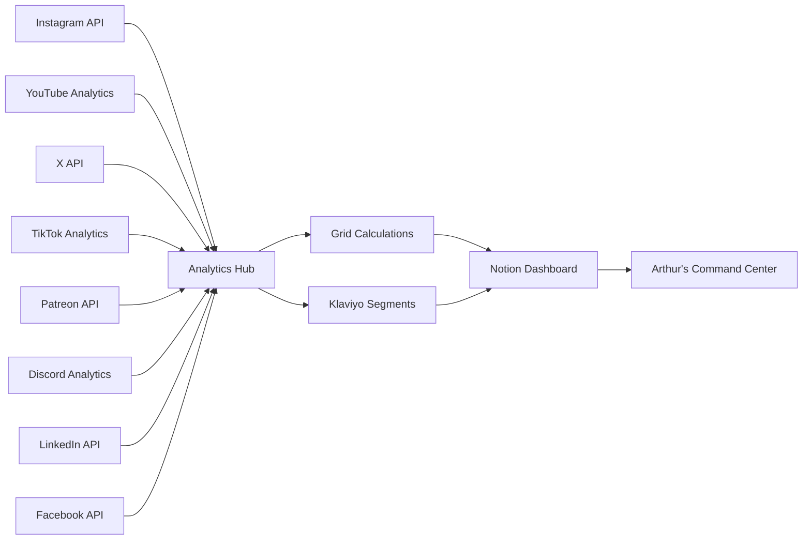

# 🎮 Petersen Games Social Media & Engagement Analytics Plan

## 📊 Analytics Dashboard Architecture

### Core Platform Setup
- **Notion Intelligence Portal**: Central command center with Arthur as Member
- **Klaviyo Integration**: Email engagement tracking and automation
- **Grid API**: Advanced analytics calculations and optimization
- **Social Media Analytics Hub**: Cross-platform engagement tracking

## 🎯 Phase 1: Foundation Setup (Week 1)

### Social Media Intelligence Center
Create new Notion database with these properties:

**Platform Tracking:**
- Platform (Select: Instagram, X (Twitter), TikTok, YouTube, Facebook, LinkedIn, Patreon, Discord)
- Content Type (Select: Product Launch, Community, Educational, Behind-Scenes)
- Engagement Score (Formula: Calculated via Grid API)
- Reach Metrics (Number)
- Conversion Tracking (Relation to Klaviyo campaigns)

**Content Intelligence Properties:**
- Brand Voice Alignment (Progress bar: Auto-calculated)
- Horror Gaming Appeal (Select: High, Medium, Low)
- Collector Interest Level (Progress bar)
- Strategic Value Score (Number: Grid API calculated)

### Klaviyo Social Sync Integration
```javascript
// Social Media → Klaviyo Pipeline
const socialKlaviyoIntegration = {
  triggers: [
    'instagram_engagement',
    'youtube_view_completion',
    'x_tweet_engagement',
    'facebook_page_like',
    'patreon_subscription',
    'discord_server_join',
    'tiktok_video_interaction',
    'linkedin_company_follow'
  ],
  
  dataCollection: {
    engagementType: 'social_interaction',
    contentCategory: 'horror_gaming_interest',
    audienceSegment: 'collector_potential',
    conversionProbability: 'grid_calculated'
  },
  
  automatedSequences: {
    highEngagement: 'VIP_collector_series',
    moderateEngagement: 'game_enthusiast_nurture',
    productInterest: 'specific_game_sequence'
  }
}
```

## 🚀 Phase 2: Content Intelligence System (Week 2)

### Smart Content Planning Dashboard
**Automated Content Calendar** with Grid API optimization:

- **Optimal Posting Times**: Grid-calculated engagement windows
- **Content Performance Prediction**: AI-powered success probability
- **Audience Sentiment Tracking**: Real-time horror gaming community mood
- **Competitor Analysis**: Automated tracking of similar board game brands

### Cross-Platform Analytics Integration


## 📈 Phase 3: Growth & Engagement Campaigns (Week 3)

### Strategic Campaign Types

#### 1. Collector Acquisition Campaign
**Target**: High-value horror gaming collectors
**Platforms**: Instagram, YouTube, Facebook Groups
**Tracking**: 
- Engagement depth score (Grid calculated)
- Purchase intent signals (Klaviyo tracked)
- Community participation metrics

#### 2. Product Launch Amplification
**Target**: Existing customers + warm prospects
**Strategy**: Multi-platform coordinated launch
**Analytics**:
- Cross-platform reach optimization
- Conversion attribution tracking
- Revenue impact measurement

#### 3. Community Engagement Series
**Target**: Horror gaming enthusiasts
**Content**: Behind-scenes, tutorials, community highlights
**Metrics**:
- Community growth velocity
- Engagement quality scores
- Brand loyalty indicators

#### 4. Patreon Exclusive Content Strategy
**Target**: VIP Collectors & Horror Gaming Enthusiasts
**Content**: Exclusive Cthulhu Wars content, early access, designer insights
**Metrics**:
- Subscription conversion rate
- Retention rate (monthly/yearly)
- Tier upgrade frequency
- Exclusive content engagement

#### 5. Discord Community Building
**Target**: Active gaming community members
**Content**: Live discussions, game nights, exclusive announcements
**Metrics**:
- Server growth rate
- Daily active members
- Message engagement rates
- Voice channel participation
- Community event attendance

### Automation Workflows

#### Social → Email Integration
```
High Social Engagement → Klaviyo VIP Segment → Exclusive Content Access
Product Interest Signal → Targeted Email Sequence → Conversion Tracking
Community Participation → Brand Ambassador Pipeline → Advocacy Metrics
```

## 🎯 Phase 4: Advanced Analytics & Optimization (Week 4)

### Grid API Enhanced Analytics

#### Revenue Attribution Model
- **Social Touch Points**: Track full customer journey
- **Conversion Path Analysis**: Multi-platform attribution
- **Customer Lifetime Value**: Social engagement impact
- **ROI Optimization**: Budget allocation recommendations

#### Predictive Analytics Dashboard
- **Viral Content Prediction**: Grid-powered success probability
- **Optimal Campaign Timing**: Audience behavior patterns
- **Budget Allocation Optimization**: Maximum ROI distribution
- **Competitor Response Modeling**: Market reaction predictions

### Arthur's Command Interface

#### Daily Analytics Digest (5-minute review)
- **Performance Snapshot**: Key metrics across all platforms
- **Action Alerts**: Grid-identified optimization opportunities
- **Content Recommendations**: AI-suggested posting strategies
- **Revenue Impact**: Social media contribution to sales

#### Weekly Strategic Review (30-minute deep dive)
- **Campaign Performance Analysis**: Detailed ROI breakdown
- **Audience Evolution Tracking**: Community growth patterns
- **Competitive Landscape**: Market positioning insights
- **Strategic Optimization**: Grid-recommended adjustments

## 📋 Implementation Checklist

### Week 1: Foundation
- [ ] Set up Social Media Intelligence Center in Notion
- [ ] Configure Klaviyo social tracking integration
- [ ] Connect Arthur as admin member with full access
- [ ] Establish baseline metrics for all platforms

### Week 2: Intelligence
- [ ] Deploy Grid API analytics calculations
- [ ] Configure automated content performance tracking
- [ ] Set up cross-platform engagement monitoring
- [ ] Create brand voice alignment validation

### Week 3: Campaigns
- [ ] Launch collector acquisition campaign
- [ ] Implement product launch coordination system
- [ ] Activate community engagement automation
- [ ] Deploy social → email conversion tracking

### Week 4: Optimization
- [ ] Enable predictive analytics dashboard
- [ ] Configure revenue attribution modeling
- [ ] Activate budget optimization recommendations
- [ ] Complete Arthur's command interface setup

## 🎮 Success Metrics

### Engagement Quality
- **Depth Score**: Grid-calculated engagement quality (target: 85%+)
- **Conversion Rate**: Social → email → purchase (target: 15%+)
- **Community Growth**: Quality audience expansion (target: 20%/month)

### Revenue Impact
- **Attribution Accuracy**: Social media revenue contribution (target: 25%+)
- **Customer Lifetime Value**: Social-acquired vs. other channels
- **ROI Optimization**: Cost per acquisition improvement (target: 30%+)

### Automation Efficiency
- **Manual Task Reduction**: Automated vs. manual work (target: 70%+)
- **Response Time**: Community engagement speed (target: <2 hours)
- **Content Quality**: Brand alignment score (target: 90%+)

## 🚀 Immediate Next Steps

1. **Today**: Set up Social Media Intelligence Center database in Notion
2. **This Week**: Configure Klaviyo social tracking integration
3. **Next Week**: Deploy Grid API analytics for performance optimization
4. **Month 1**: Launch first coordinated multi-platform campaign with full tracking

Your Notion Intelligence Portal with Arthur as Member provides the perfect foundation for this comprehensive social media analytics system. The integration with Klaviyo and Grid API will deliver automated optimization and revenue attribution that scales with your horror gaming community growth! 🎯✨